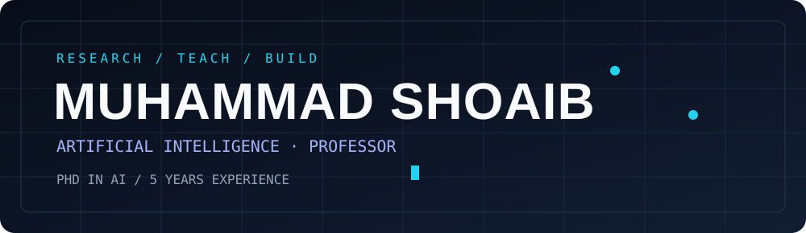

<picture>
  <source media="(prefers-reduced-motion: reduce)" srcset="./assets/header-static.svg" />
  
</picture>

 

### Artificial Intelligence · Academic Teaching · Software Development

**5 years of professional experience** · **Professor** · **PhD in Artificial Intelligence**

*Where research, teaching, and real-world software engineering meet.*

---

## About me

I work at the intersection of **artificial intelligence, higher education, and software development**. My interests include turning research concepts into practical solutions, mentoring future engineers, and developing applications that address real-world needs.

- 🎓 **Academic focus:** PhD in Artificial Intelligence
- 👨‍🏫 **Professional role:** Professor
- 💼 **Experience:** 5 years
- 🧠 **Interests:** Artificial intelligence, applied research, and software engineering
- 🛠️ **Portfolio:** CRM, WorkdeskVA, Brain Segmentation, and Janus App

## Featured work

<table>
<tr>
<td width="50%" valign="top">

### 01 — Brain Segmentation
A project focused on brain-image segmentation. See the repository for its actual implementation and dependencies.

<a href="https://github.com/shoaibzahid560/Brain-Segmentation/tree/main/code-bca-main/code-bca-main"><b>Explore repository →</b></a>
</td>
<td width="50%" valign="top">

### 02 — Janus App
An application project. Technical features and deployment details should be described after reviewing its source.

<a href="https://github.com/shoaibzahid560/Janusapp-main"><b>Explore repository →</b></a>
</td>
</tr>
<tr>
<td width="50%" valign="top">

### 03 — CRM
Customer relationship and workflow management project. Add its authorized repository or live-demo link when available.

**Repository / demo:** To be added
</td>
<td width="50%" valign="top">

### 04 — WorkdeskVA
Remote staffing and virtual assistant platform with a web-based service experience.

**Repository / demo:** To be added
</td>
</tr>
</table>

## Areas of focus

> **Technology stack:** Add only technologies confirmed by Shoaib or identified in his repositories. This is deliberately left factual rather than filled with unverified icons.

## GitHub activity

<picture>
  <source media="(prefers-color-scheme: dark)" srcset="https://raw.githubusercontent.com/shoaibzahid560/shoaibzahid560/output/github-snake-dark.svg" />
  
</picture>

Snake appears once the included GitHub Actions workflow runs successfully.

## Education and experience

| Area | Background |
|:--|:--|
| Doctoral study | PhD in Artificial Intelligence |
| Academic career | Professor |
| Professional experience | 5 years |

## Connect

  

Research · Teach · Engineer · Innovate

